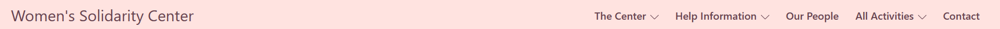
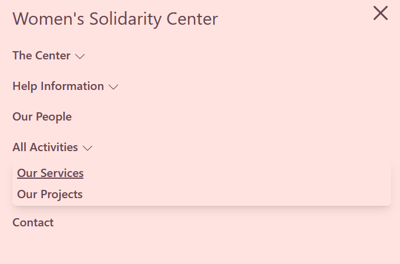
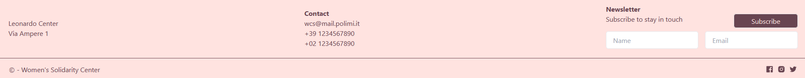
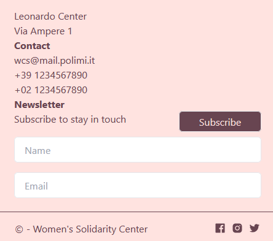
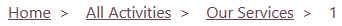
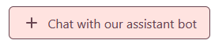
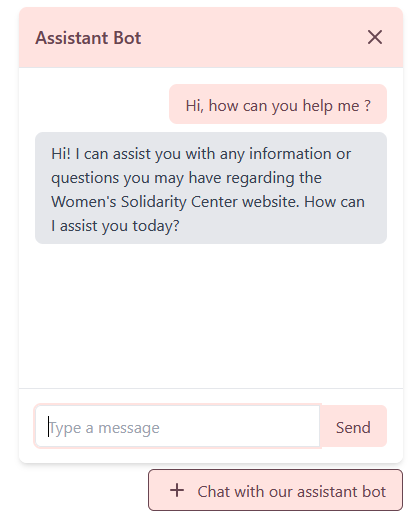

# Technical Documentation

## Work Breakdown

| Member                | Pages                                                                         |
|-----------------------|-------------------------------------------------------------------------------|
| Federica Giannunzio   | Home Page, People/id, Our Projects, Project/id, Server Api                    |
| Isabella Guglielmelli | About Us, Our Mission, Help Information, For You, For Others, Contact, DB     |
| Léandre  Le Bizec     | Our People, All Activities, Our Services, Service/id, ChatBot, NavBar, Footer |

## Technologies

- For the frontend, we have used Nuxt 3 with tailwindcss for the style;
- For the backend, we have used NodeJS with Express;
- For the database, we have use SupaBase,
- For the deployment we have used Vercel, the website is accessible online through this link :

## Responsiveness

The website was built with responsiveness as a key priority. Each element is designed to adapt and alter its appearance accordingly. For instance, on smaller devices like smartphones or tablets, the full navigation bar is concealed and replaced by a hamburger menu. Additionally, the grids and paragraphs adjust to display only one element per line when the viewport size is limited. The chatbot window is also configured to be displayed correctly on any screen size.

## Running the website on your device

In a shell :
- `git clone ...`;
- in the files : create a .env file and import OPENAI_API_KEY, SUPABASE_URL and SUPABASE_KEY;
- `cd hmw-app`
- `npm install`
- `npm run dev`

To build :
- `npm run build`

--- 

## Components

We developed the website components with a focus on maximizing their reusability across various pages. This approach not only enhances modularity but also improves system usability by presenting users with familiar components throughout their browsing experience.

### NavBar

Responsive NavBar with navigation links and sub menu with navigation link.

### Footer 

Responsive NavBar with contact information, social media links and new letter subscription.

### Breadcrumb

Dynamic breadcrumbs display the path from the Home page to the current page. Pages other than the Home page are links. The path is retrieve from the URL and display with some regex rules.

### ChatBox

ChatBot using Open AI API, model chatgpt-turbo-3.5. The role of this chatbot is, firstly, to provide assistance to the user during his research on the website. Secondly, to be able to handle emergency situations by calming someone in panic and providing the good ressources to this person.

--- 

## Backend and API
The backend was implemented with Supabase.

TO DO : 
/server/api